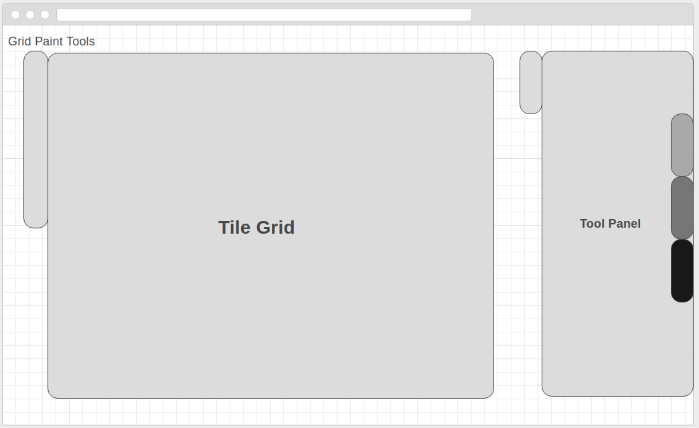
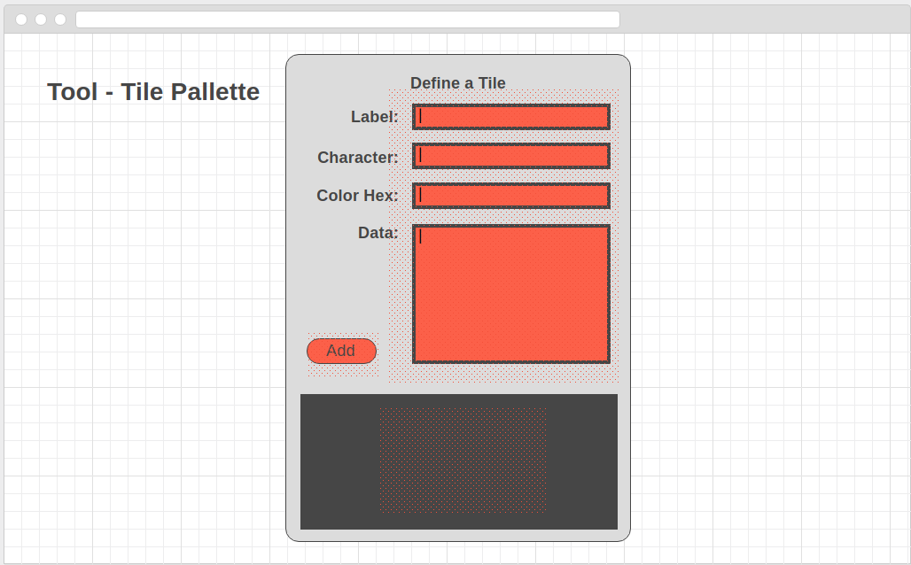

# Main
  
[wireframe.cc](https://wireframe.cc/4zxUgw)

# Tools
## Tile Palette
  
[wireframe.cc](https://wireframe.cc/H2anGu)  
**Notes**
- 'Add' button will only be visible when a new Tile is being created, It will say 'Update' if the tile is being edited
- The bottom section will contain small squares representing previously saved tile plus a 'new tile' square to open a form for new tile creation
- Form fields will be empty for new tiles and filled for after selecting previously saved tile from the palette.